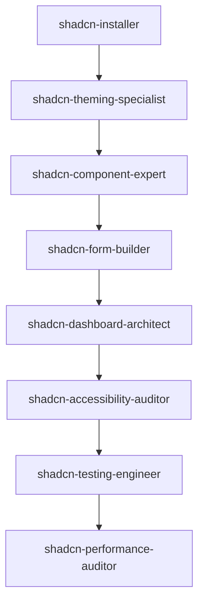

# Shadcn/UI Claude Code Agent Collection

> A comprehensive collection of 12 specialized Claude Code agents for shadcn/ui development, providing expert-level guidance across the entire development lifecycle.

[](/.claude/agents)
[](#agent-collection)
[](https://ui.shadcn.com/)

## 🎯 Overview

This project provides a complete ecosystem of specialized Claude Code agents, each expertly designed for specific aspects of shadcn/ui development. From initial project setup to advanced optimization and migration, these agents deliver production-ready guidance with comprehensive validation frameworks.

## 🏗️ Agent Collection

### 🚀 **Setup & Configuration**
- **[shadcn-installer](/.claude/agents/shadcn-installer.md)** - Multi-framework setup expert (Next.js, Vite, Remix, Astro, Laravel)
- **[shadcn-theming-specialist](/.claude/agents/shadcn-theming-specialist.md)** - CSS variables, dark mode, brand integration

### 🧩 **Component Development**
- **[shadcn-component-expert](/.claude/agents/shadcn-component-expert.md)** - Deep component knowledge and usage patterns
- **[shadcn-form-builder](/.claude/agents/shadcn-form-builder.md)** - React Hook Form, Zod validation, complex forms

### 🎨 **User Experience**
- **[shadcn-dashboard-architect](/.claude/agents/shadcn-dashboard-architect.md)** - Admin dashboards, data tables, complex layouts
- **[shadcn-data-visualizer](/.claude/agents/shadcn-data-visualizer.md)** - Recharts, D3.js, interactive visualizations
- **[shadcn-animation-specialist](/.claude/agents/shadcn-animation-specialist.md)** - Framer Motion, CSS animations, micro-interactions

### 📱 **Optimization & Performance**
- **[shadcn-mobile-optimizer](/.claude/agents/shadcn-mobile-optimizer.md)** - Mobile-first design, touch interfaces, PWA
- **[shadcn-performance-auditor](/.claude/agents/shadcn-performance-auditor.md)** - Bundle optimization, Core Web Vitals

### 🔧 **Quality & Migration**
- **[shadcn-accessibility-auditor](/.claude/agents/shadcn-accessibility-auditor.md)** - WCAG compliance, inclusive design
- **[shadcn-testing-engineer](/.claude/agents/shadcn-testing-engineer.md)** - Jest, RTL, Playwright, visual regression
- **[shadcn-migration-specialist](/.claude/agents/shadcn-migration-specialist.md)** - Migration from Material-UI, Chakra UI, Ant Design

## ✨ Key Features

### 🎯 **Specialized Expertise**
Each agent provides deep domain knowledge with:
- **Production-ready code examples** with TypeScript
- **Comprehensive validation guidelines** (DO's and DON'Ts)
- **Real-world implementation patterns**
- **Performance optimization techniques**

### 📋 **Validation-First Approach**
Every agent includes:
- ✅ **Best Practices** - Recommended patterns and techniques
- ❌ **Anti-patterns** - Common mistakes and pitfalls to avoid
- 📝 **Checklists** - Step-by-step validation processes
- 🧪 **Testing Strategies** - Quality assurance methodologies

### 🔄 **Seamless Integration**
Agents work together cohesively:
- **Project Setup Flow**: installer → theming → accessibility validation
- **Feature Development**: component selection → implementation → optimization
- **Quality Assurance**: testing → accessibility → performance monitoring

## 🚀 Getting Started

### 1. Project Setup
```bash
# Use shadcn-installer for initial configuration
npx shadcn@latest init
```

### 2. Component Development
Consult **shadcn-component-expert** for:
- Component selection and usage patterns
- Proper composition techniques
- Advanced implementation scenarios

### 3. Theming & Design
Apply **shadcn-theming-specialist** for:
- CSS custom properties setup
- Dark mode implementation
- Brand color integration

### 4. Forms & Validation
Leverage **shadcn-form-builder** for:
- React Hook Form integration
- Zod schema validation
- Complex form layouts

### 5. Quality Assurance
Use **shadcn-testing-engineer** and **shadcn-accessibility-auditor** for:
- Comprehensive test coverage
- WCAG compliance validation
- Cross-browser compatibility

### 6. Performance Optimization
Apply **shadcn-performance-auditor** and **shadcn-mobile-optimizer** for:
- Bundle size optimization
- Core Web Vitals improvement
- Mobile-first responsive design

## 💡 Usage Examples

### Setting up a new project
```bash
# 1. Initialize project (shadcn-installer)
npx shadcn@latest init

# 2. Add components (shadcn-component-expert)
npx shadcn@latest add button input card

# 3. Setup theming (shadcn-theming-specialist)
# Configure CSS variables and dark mode

# 4. Implement forms (shadcn-form-builder)
# Setup React Hook Form + Zod validation
```

### Building a dashboard
```typescript
// 1. Layout structure (shadcn-dashboard-architect)
// 2. Data visualization (shadcn-data-visualizer)  
// 3. Mobile optimization (shadcn-mobile-optimizer)
// 4. Performance audit (shadcn-performance-auditor)
```

### Migrating from Material-UI
```bash
# Use shadcn-migration-specialist for:
# - Component mapping strategies
# - Automated migration scripts
# - Gradual migration planning
```

## 📊 Agent Interaction Patterns

### **Project Lifecycle**


### **Quality Assurance Flow**
1. **Development**: Component expert + Form builder
2. **Enhancement**: Animation + Data visualization
3. **Validation**: Testing + Accessibility auditing
4. **Optimization**: Performance + Mobile optimization

## 🛠️ Technical Stack

### **Supported Frameworks**
- Next.js (App Router & Pages Router)
- Vite + React
- Remix
- Astro
- Laravel + Inertia.js
- Gatsby

### **Key Technologies**
- **UI**: shadcn/ui + Radix UI + Tailwind CSS
- **Forms**: React Hook Form + Zod
- **Testing**: Jest + React Testing Library + Playwright
- **Animation**: Framer Motion + CSS animations
- **Charts**: Recharts + D3.js + Chart.js
- **Build**: Vite + Webpack + Turbo

## 📈 Performance & Quality Standards

### **Performance Budgets**
- Initial JS: < 150KB (gzipped)
- Total JS: < 300KB (gzipped)
- Initial CSS: < 50KB (gzipped)
- LCP: < 2.5s
- FID: < 100ms
- CLS: < 0.1

### **Accessibility Standards**
- WCAG 2.1 AA compliance
- Screen reader compatibility
- Keyboard navigation support
- Color contrast ratio ≥ 4.5:1
- Focus management

### **Testing Coverage**
- Unit tests: > 80% coverage
- Integration tests for critical paths
- E2E tests for user workflows
- Visual regression testing
- Accessibility testing with axe

## 🤝 Contributing

Each agent follows a structured format with:
- **Expert domain knowledge**
- **Production-ready examples**
- **Comprehensive validation guidelines**
- **Testing strategies**
- **Performance considerations**

## 📄 License

This project is part of the Claude Code ecosystem and follows Anthropic's usage guidelines.

## 🔗 Links

- [shadcn/ui Official Documentation](https://ui.shadcn.com/)
- [Radix UI Primitives](https://www.radix-ui.com/)
- [Tailwind CSS](https://tailwindcss.com/)
- [Claude Code Documentation](https://docs.anthropic.com/claude-code)

---

**Built with ❤️ for the shadcn/ui community**